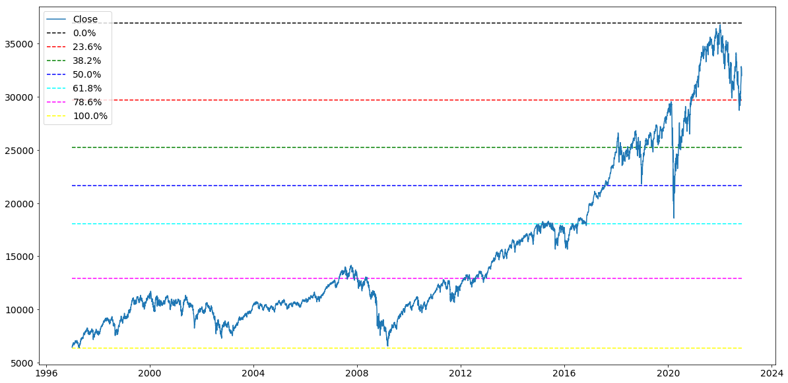
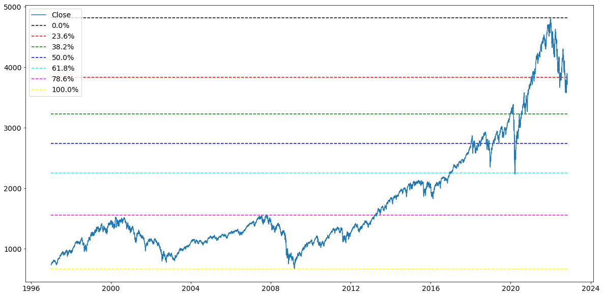
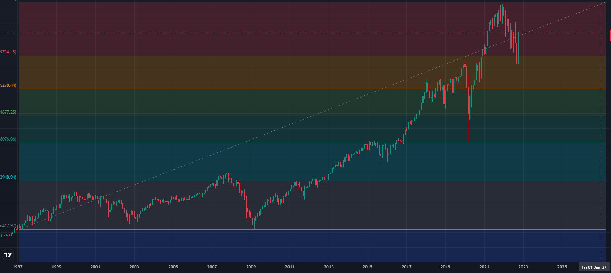

# Fibonacci Retracement and Analysis

* Fibonacci analysis of 3 major indices over the past 25 years. Using this data we will analyze and detail entry points historically, as well as potential future entry points.


# Installion Guide

```
conda activate base
conda create -n project1env python=3.7 -y
conda activate project1env
conda install -c conda-forge python-dotenv -y
conda install -c anaconda nb_conda -y
conda install -c conda-forge nodejs=12 -y
conda install -c pyviz holoviz -y
conda install -c plotly plotly -y
conda install -c conda-forge jupyterlab=2.2 -y
conda install -c anaconda numpy==1.19 -y
conda install -c conda-forge matplotlib==3.0.3 -y
jupyter labextension install @jupyter-widgets/jupyterlab-manager --no-build
jupyter labextension install jupyterlab-plotly --no-build
jupyter labextension install plotlywidget --no-build
jupyter labextension install @pyviz/jupyterlab_pyviz --no-build
jupyter lab build
pip install yfinance
```

# Timeline
    - Day 1 : Proposal and Research
    - Day 2 : Building  Fibonacci Retracement in Python
    - Day 3 : Building and Finishing Retracement Code
    - Day 4 : Markdown and Documentation
    - Day 5 : Final touches to Markdown and Presentation Prep


# Project Team
* Tim Clemens 
* Max Heatter 
* Brandon Latherow
* Gregory Neubel Jr.

# Fibonacci Background
* A Fibonacci Sequence is a series of numbers, starting with zero and one, in which each number is the sum of the previous two numbers. This sequence extends to infinity and is summarized with the formula: 

* Fibonacci is based around the Golden Ratio which can be found all around in nature. The Golden Ratio is equal to 0.618 or 1.618. This ratio is created using the following formula: a/b = (a+b)/a =1.618... This ratio is then used to create a percentage is associates with being: 23.6%, 38.2%, 61.8%, and 78.6%. These percentage levels are used in retracement along with a 50% level. Although 50% is not a true Fibonacci Level or number it is used with the retracement to add accuracy for support and resistance.

  

# Data Analysis
* Using the Retracement of the total 25 year analysis, we were able to see how the historical crashes of these indicies correlated with the support levels of Fibonacci. On the other hand, as the indicies rose in value, and hit high points, the closing price had strong and consistant correspondance to the resistance levels over the time frame analyzed.
## Dow Jones

## Nasdaq Composite

## S&P 500


# Challenges
* There were multiple challenges we had with this project, one of such challenges was expanding the Fibonacci Retracement Lines to future dates. We thought of a way of manually adding dates to the table with "null" values except for the "Date", but do to time constraints we could test the idea or put it into practice. 
* We also tried to make the retracement using hvplot instead of pyplot, but again due to time constraints we were unable to finish the retracement code.
* Lastly we had difficulty using our code to easily and accurately find trends using smaller sample sizes/data frames.


# Investing
## Investment Strategies
 
### Single Option Strategies
- Buying Calls 
- Writing Calls
- Buying Puts
- Writing Puts
 
### Buying Calls  (Owner/Long/Bullish)
- Investor speculate the underline price of stock will rise
- Can profit on upward price movement by only paying the premium 
- Provides investor w/ greater leverage (higher potential percentage return)
- Deferring to purchase in the future, great way to lock in XP/Sales price of stock
- Investors also use calls to protect a short stock position, a popular way to hedge.
  - Note: Short/position holders lose when the stock price rises, facing potential unlimited loss. 
 
### Writing Calls (Seller/Short/Bearish)
- Investor believes stock’s price will decline or stay the same
- Does not own stock, protection does not exist. (Naked, Uncovered)
- Has obligation to sell
- Unlimited potential risk of loss
	- Note: Call writers profit if the stock’s price falls below or stays at the strike price.
		Most often a strategy for an uncovered writer to earn the premium.
 
### Buying Puts (Owner/Long/Bearish)
- Investor can profit from a decrease in the stock price, while investing in small amounts
- If stock falls below the strike price, while in the money, may result in a profit
- Locks in stock sales price until the option expires.
- Protects appreciation potential until expiration date
 
### Writing Puts (Seller/Short/Bullish)
- Investors believe the stock is going to rise
- Can profit/earn premium if stock price rises above strike price 
- Investors hope the put option expires to keep premium  
- Huge Risk!
 
 
 
## Order Type Strategies
 
- Market Orders
- Limit Order
- Stop Order (Stop Loss)
 
### Market Orders 
- Are sent immediately to the trading floor for execution without restrictions or limits. Executed immediately at the current market price and has priority over all orders. 
- Buy order: executed at the lowest offering price available 
- Sell order: executed at the highest bid price available 
 
### Limit Orders
- Investors limits the acceptable purchase or selling price
- Executed only at specified price or better.
- Buy Limit Orders: Investors believe stock is overpriced and would like to buy low with the dip in the market. Placed below the current market.
- Sell Limit Orders: Investors who own the stock believe the stock they own is currently undervalued, would place sell limit orders to sell the stock if it should rise to desired level.
 
### Stop Orders
- Designed to protect profit or prevent loss if stock moves in wrong direction
- Sell Stop: Entered below current market
  - Protects profit or loss in a long stock position.
  - Technical analysis believes that if a stock breaks through the support, it will fall like a rock.
- Buy Stop: Entered above current market
  - Protects a profit or loss in a short stock position
  - Triggered when the market price touches or goes through the buy stop price
  - Used by technical analysis who track support and resistance levels for stock.

# Findings and Possible Courses of Action
## S&P 500
- Through analysis of Fibonacci Retracement we are predicting a support line and bottom for the S&P 500. 
- Price $3200
- As early as Late Feb, 2023
## Nasdaq 
- Using the Fibonacci Retracement the Nasdaq is currently at a level of support. It has been at this support level for roughly a month trying to rebound positively, but has just been hovering.
- Price $10462.71
- Now could be the perfect time to enter.
## Dow Jones 
- 23rd of September the DJI reached its support level and proceeded to hover until the middle of October. From October 14th to Present Day (November 7th), the DJI has risen from slightly beneath the support level at $29634.33 to $32830.89. From this retracement and analysis it is hard to make an accurate prediction with the path of the DJI, the time to invest, at least for short term, looks to have passed.

# Future Expanse 

### EXPANSION OF PYTHON LIBRARIES

* Python Technical Analysis 
  - TA-Lib
* Machine Learning Libraries
  - Sci-kit-learn
  - Keras
  - Tensor Flow

* Python Trading Libraries For Backtesting
  - PyAlgoTrade
  - Zipline
  - PyBacktest (BACKTESTING)

* Python Data Collection
  - Ultrafinance
  - TWP (Trading WIth Python)
  - IBridgePy

### MODELING AND COMPARISON (LIKE THE BIG BANKS)

* Comparing Fibonacci Retracement with Machine Learning models such as
  - Monte Carlo Simulation
  - Markov Chain Simulation
  - Bootstrap
  - Black Scholes
  - Discrete Event Simulation

* insert image

# Resources
* https://www.investopedia.com/terms/f/fibonacciretracement.asp 
* https://blog.quantinsti.com/fibonacci-retracement-trading-strategy-python/
* https://towardsdatascience.com/fibonacci-retracements-in-python-470eb33b6362  

